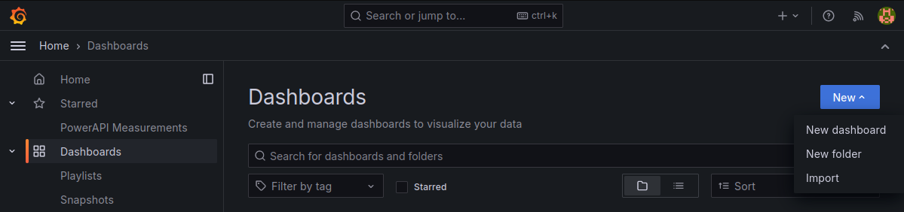

# Visualizing Power Consumptions on Grafana

Here it is explained how to visualize the power estimation computed by a Formula on a Grafana dashboard to obtain this kind of visualisation:

{ width="1000px"}

<!--img
src="https://powerapi.org/assets/images/reference/grafana/viz_by_process.png"
alt="viz_by_process" width="1000px"-->

This screenshot shows the visualisation of power consumption of a `Firefox` web browser and tools used for monitoring (MongoDB, InfluxDB, Sensor, Formula)

In this tutorial, we describe how to connect a Formula to a Grafana instance by using InfluxDB 2.X as output for Power Report.  
Then, we will see how to configure Grafana to visualize the power estimation computed by the Formula.  

This tutorial assumes that you know how launch a Formula and a Sensor to compute power estimation and that you have an InfluxDB 2.X running on your local machine.  

The InfluxDB 2.X instances listen on port `8086` by default.

## Setup Grafana

The default installation is done through Docker container.  
The different images can be found on the [Docker Hub](https://hub.docker.com/r/grafana/grafana)  

Here is an example to deploy the latest image version available.
```sh
docker run -d -p 3000:3000 grafana/grafana
```

After the launch, Grafana will be available at http://localhost:3000. On the signin page, enter *admin* for username and password.

## Connect Grafana to the InfluxDB 2.X instance

Follow [this documentation](https://grafana.com/docs/grafana/latest/datasources/influxdb/#configure-the-data-source) in order to add InfluxDB as a DataSource.  
Be carefull to use the documentation matching your Grafana version.  


## Visualize the power consumption on a dashboard in real-time

1. Go to the `"Dashboard"` section on the side bar and select on `New > New dashboard`
2. Then click on `+ Add visualisation`
3. Then select the previously added datasource as data source

{ width="1000px"}

<!--img
src="https://powerapi.org/assets/images/reference/grafana/add_dashboard.png"
alt="add_dashboard" width="1000px"-->

4. Click on the query edition button (the one with a pencil on it) and write the following query on the `Query` field to request the power estimations from the InfluxDB 2.X measurement:

```sql
SELECT power FROM "power_consumption" GROUP BY target
```

Then write `$tag_target` on the `ALIAS BY` field to label each graph with the target name

{ width="1000px"}

<!--img
src="https://powerapi.org/assets/images/reference/grafana/add_query_by_process.png"
alt="add_query_by_process" width="600px"-->

To display the power consumption in real time, you can update the range of the visualisation to `last 5 minutes` and the `refresh dashboard` parameter to `5s`. This parameter are on the top-right corner of the UI.

{ width="1000px"}

<!--img
src="https://powerapi.org/assets/images/reference/grafana/refresh.png"
alt="refresh" width="600px"-->
