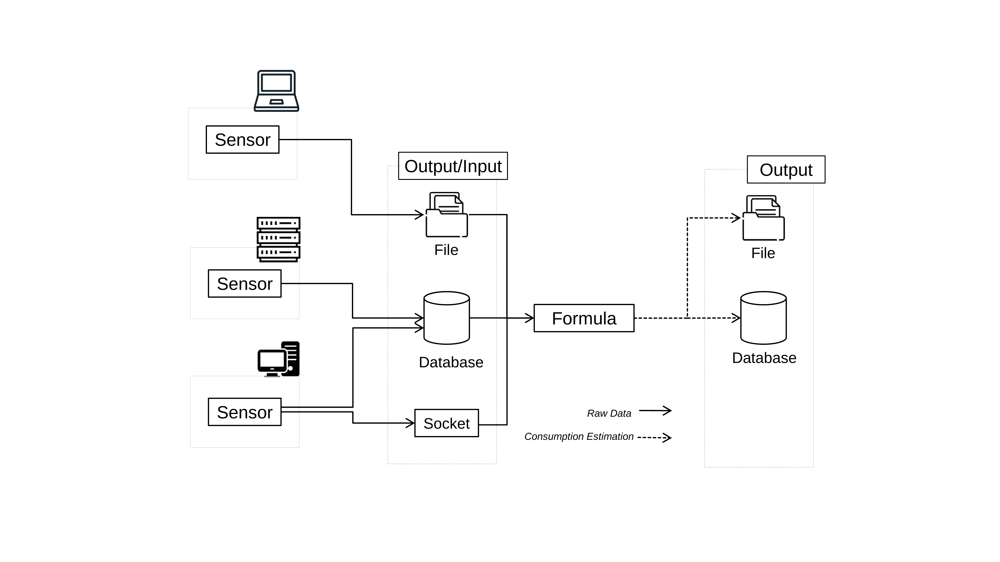

# PowerAPI Overview

This project aims to offer a range of tools to promote greener computing. The focus is on creating software-defined PowerMeters to measure the power consumption of various programs.  
At the heart of this initiative is the [PowerAPI](https://github.com/powerapi-ng/powerapi) toolkit, which facilitates the development of these PowerMeters.

## Software PowerMeters

A software PowerMeter is an application built using PowerAPI components, designed to measure the power consumption of software running on a single machine or across a cluster of machines.

The diagram below illustrates the overall architecture of a PowerMeter within the PowerAPI framework.

{ width="1000px"}

A PowerMeter consists of two essential components:  

- A [Sensor](#Sensor), which collects system usage metrics and generates usage reports.  
- A [Formula](#Formula), which applies a computational model to the usage reports, producing power consumption data (in mJ).  

Additionally, [Preprocessors](./overview.md#Preprocessors) can be utilized to modify usage reports before they are processed by the Formula.

## Sensor

The Sensor is a standalone software tool that gathers basic data related to the power usage of the software it monitors.

It collects this data by querying the hardware on the same machine where the monitored software runs. The Sensor needs to operate in parallel to the monitored software for the entire duration of its execution.

The raw data collected is then stored as usage Reports in various formats, either locally or remotely. These formats include CSV, MongoDB, FileDB, and UNIX sockets, among others.

### Existing Sensors

| Sensor name | Documentation | GitHub Repository | Description | Supported |
| :---------------: |----------------------|--------------------------|----------------|---------------|
| HWPC            | [HWPC Documentation](./sensors/hwpc-sensor.md) | https://github.com/powerapi-ng/hwpc-sensor | Hardware Performance Counters monitoring agent for containers |  :material-check: Supported |

## Formula

A Formula is a computational module that estimates the power consumption of the monitored software using the data collected by the Sensor.

There are two modes in which a Formula can operate:

- **Stream mode**: In this mode, the Formula processes data from the Sensor as it is generated, providing real-time insights  

- **Post-mortem mode**: In this mode, the Formula analyzes data that has already been collected by the Sensor during a previous monitoring phase  

### Existing Formulas

| Formula name | Documentation | GitHub Repository | Description | Supported |
| :---------------: |----------------------|--------------------------|----------------|---------------|
| SmartWatts            | [SmartWatts Documentation](./formulas/smatwatts.md) | https://github.com/powerapi-ng/smartwatts-formula | HSmartWatts is a formula for a self-adaptive software-defined power meter based on the PowerAPI framework.  |  :material-check: Supported |

## Processors

Processors allow for the customized filtering and modification of Reports. While optional, they offer additional flexibility, but Software PowerMeters can still function without them.

The diagram below shows where Processors are integrated into the architecture of a Software PowerMeter.

### Preprocessors

Preprocessors are positioned between the [Sensor](./overview.md#Sensor) and the [Formula](./overview.md#Formula).  
Their role is to pre-process usage reports before the power consumption estimations are computed.

#### Existing Preprocessors

| Preprocessor name | Documentation | GitHub Repository | Description | Supported |
| :---------------: |----------------------|--------------------------|----------------|---------------|
| k8sPreprocessor            | [k8sPreprocessor Documentation](./processors/processors.md#k8spreprocessor) | https://github.com/powerapi-ng/powerapi/tree/master/src/powerapi/processor/pre/k8s | Add K8S Specific metadata to corresponding Reports |  :material-check: Supported |
| libvirt | [libvirtPreprocessor Documentation](.processors/processors.md#libvirt) | https://github.com/powerapi-ng/powerapi/tree/master/src/powerapi/processor/pre/libvirt | Replace `libvirt ID` in Reports with `Open Stack UUID` | :material-check: Supported |

