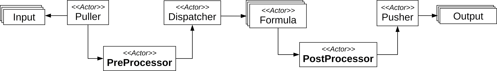

# Processors

Processors enable customized filtering and/or modifications of `Reports`.
There are two kinds of processors:

- `PreProcessors`: They are located between the `Puller` and the `Dispatcher`. They are supposed to pre-process the `HWPC Reports` before computing estimations.
- `PostProcessors`: They are located between, the `Formula` and the `Pusher`. They process `Power Reports` before storing them on the output storage option.

Figure below depicts where are they introduced in the architecture of a Software PowerMeter.

{ width="1000px"}


`Processors` are optional, which means that you can continue to use Software PowerMeters as usual if you don't need them.  

## K8s PreProcessor

This `PreProcessor` uses the Kubernetes client for Python in order to get information related to `Reports`.
In particular, pod name (`pod_name`), pod name space (`namespace`), and pod labels (`pod_labels`)  are collected.
This information is added to metadata of the concerned `Report` under `k8s` key.
The container name (`container_name`) is defined as the target of the `Report`.
If a `Report` related to Kubernetes is not identified, it is ignored (i.e., the `Report` is not send t the `Dispatcher` and will be not considered by the `Formula`).
If a `Report` is not related to Kubernetes, it is sent to the `Dispatcher` without modifications (i.e., no new metadata is added).

If you want to use a `K8sPreProcessor` in your Software PowerMeter, you have to specify
`k8s` as the `type` of the `PreProcessor`.


### Parameters

| Parameter     | Type   | CLI shortcut  | Default Value | Mandatory                                        | Description |
| ------------- | -----  | ------------- | ------------- | ----------                                              | ------------------------------------    |
|`api-mode`| string | `a` | `cluster` | No | The configuration method used to run K8s. Possible values are `local`, `manual` and `cluster`|
|`puller`| string | `p` | - | Yes | The puller's name associated with the `PreProcessor`|
|`api-host`| string | `h` | - | No | The host associated with K8s. To be used with `api-mode` = `manual`  together with `api-key`|
|`api-key`| string | `k` | - | No | The API Key associated with K8s. To be used with `api-mode` = `manual`  together with `api-host` |
|`name`| string | `n` | - | No | The name of the `PreProcessors`|


### JSON File Excerpt

```json
"pre-processor":{

"p1":{
   "type": "k8s",
   "api-mode": "local",
   "puller": "puller"

 }
}
```

As notice, a `PreProcessor` is defined inside the `pre-processor` group. In this example, we are assuming that a `puller` named `puller` is defined in the `input` group of the same configuration.

### Example of Usage with SmartWatts Formula via CLI parameters

=== "Docker"

     ```sh
     docker run -t \
     --net=host \
     powerapi/smartwatts-formula --verbose \
     --input mongodb --model HWPCReport --uri mongodb://127.0.0.1 --db test --collection prep \
     --output prometheus --model PowerReport --addr localhost --port 8010 \
     {==--pre-processor k8s --name p1 --api-mode local --puller puller==} \
     --cpu-base-freq 1900 \
     --cpu-error-threshold 2.0 \
     --disable-dram-formula \
     --sensor-reports-frequency 1000
     ```

=== "Pip"

    ```sh
    python -m smartwatts \
    --verbose \
    --input mongodb --model HWPCReport --uri mongodb://127.0.0.1 --db test --collection prep \
    --output prometheus --model PowerReport --addr localhost --port 8010 \
    {==--pre-processor k8s --name p1 --api-mode local --puller puller==} \
    --cpu-base-freq 1900 \
    --cpu-error-threshold 2.0 \
    --disable-dram-formula \
    --sensor-reports-frequency 1000
    ```

### Example of Usage with SmartWatts Formula with Environment Variables

=== "Docker"

    ```sh
    docker run -t \
    --net=host \
    -e POWERAPI_VERBOSE=true \
    -e POWERAPI_STREAM=true \
    -e POWERAPI_CPU_BASE_FREQ=1900 \
    -e POWERAPI_CPU_ERROR_THRESHOLD=2.0 \
    -e POWERAPI_DISABLE_DRAM_FORMULA=true \
    -e POWERAPI_SENSOR_REPORTS_FREQUENCY=1000 \
    -e POWERAPI_INPUT_PULLER_MODEL=HWPCReport \
    -e POWERAPI_INPUT_PULLER_TYPE=mongodb \
    -e POWERAPI_INPUT_PULLER_URI=mongodb://127.0.0.1 \
    -e POWERAPI_INPUT_PULLER_DB=test \
    -e POWERAPI_INPUT_PULLER_COLLECTION=prep \
    -e POWERAPI_OUTPUT_PUSHER_POWER_MODEL=PowerReport \
    -e POWERAPI_OUTPUT_PUSHER_POWER_TYPE=prometheus \
    -e POWERAPI_OUTPUT_PUSHER_POWER_ADDR=localhost \
    -e POWERAPI_OUTPUT_PUSHER_POWER_PORT=8010 \
    {==-e POWERAPI_PRE_PROCESSOR_P1_TYPE=k8s \
    -e POWERAPI_PRE_PROCESSOR_P1_API_MODE=local \
    -e POWERAPI_PRE_PROCESSOR_P1_PULLER=puller==} \
    powerapi/smartwatts-formula
    ```

=== "Pip"

    ```sh
    export POWERAPI_VERBOSE=true
    export POWERAPI_STREAM=false
    export POWERAPI_CPU_BASE_FREQ=1900
    export POWERAPI_CPU_ERROR_THRESHOLD=2.0
    export POWERAPI_DISABLE_DRAM_FORMULA=true
    export POWERAPI_SENSOR_REPORTS_FREQUENCY=1000
    export POWERAPI_INPUT_PULLER_MODEL=HWPCReport
    export POWERAPI_INPUT_PULLER_TYPE=mongodb
    export POWERAPI_INPUT_PULLER_URI=mongodb://127.0.0.1
    export POWERAPI_INPUT_PULLER_DB=test
    export POWERAPI_INPUT_PULLER_COLLECTION=prep
    export POWERAPI_OUTPUT_PUSHER_POWER_MODEL=PowerReport
    export POWERAPI_OUTPUT_PUSHER_POWER_TYPE=prometheus
    export POWERAPI_OUTPUT_PUSHER_POWER_ADDR=localhost
    export POWERAPI_OUTPUT_PUSHER_POWER_PORT=8016
    {==export POWERAPI_PRE_PROCESSOR_P1_TYPE=k8s
    export POWERAPI_PRE_PROCESSOR_P1_API_MODE=local
    export POWERAPI_PRE_PROCESSOR_P1_PULLER=puller==}
    python -m smartwatts
    ```


### Example of Usage with SmartWatts Formula via a Configuration File

Below an example is provided by using MongoDB as input and InfluxDB as output.

```json
{
  "verbose": true,
  "stream": true,
  "input": {
    "puller": {
      "model": "HWPCReport",
      "type": "mongodb",
      "uri": "mongodb://127.0.0.1",
      "db": "test",
      "collection": "prep"
    }
  },
  "output": {
    "pusher_power": {
      "model": "PowerReport",
      "type": "prometheus",
      "addr": "localhost",
      "port": 8010
    }
  },
  "pre-processor":{

    "p1":{
      "type": "k8s",
      "api-mode": "local",
      "puller": "puller"
    }
  },

  "cpu-base-freq": 1900,
  "cpu-error-threshold": 2.0,
  "disable-dram-formula": true,
  "sensor-reports-frequency": 1000
}
```


## OpenStack PreProcessor

This `PreProcessor` uses the OpenStack client for Python in order to get information related to `Reports`.
In particular, server name (`server_name`), server identifier (`server_id`), host (`host`), instance name (`instance_name`) and metadata (`metadata`) are collected.
This information is added to metadata of the concerned `Report` under `openstack` key.
The server name (`server_name`) is defined as the target of the `Report`.
If a instance name cannot not be extracted from a `Report` target by using the `libvirt cgroup`, the metadata is not added and the `Report` is therefore sent to the `Dispatcher` without modifications.

If you want to use a `OpenStack Prepocessor` in your Software PowerMeter, you have to specify
`openstack` as the `type` of the `PreProcessor`.


### Parameters

| Parameter     | Type   | CLI shortcut  | Default Value | Mandatory                                        | Description |
| ------------- | -----  | ------------- | ------------- | ----------                                              | ------------------------------------    |
|`puller`| string | `p` | - | Yes | The puller's name associated with the `PreProcessor`|
|`polling-interval`| float | `i` | `10.0` | No | OpenStack API polling interval (in seconds)|
|`name`| string | `n` | `preprocessor_openstack` | Yes | The name of the `PreProcessors`|


### JSON File Excerpt

```json
"pre-processor":{

"p2":{
   "type": "openstack",
   "polling-interval": 20,
   "puller": "puller2"

 }
}
```
As notice, a `PreProcessor` is defined inside the `pre-processor` group. In this example, we are assuming that a `puller` named `puller2` is defined in the `input` group of the same configuration.


### Example of Usage with SmartWatts Formula via CLI parameters

=== "Docker"

     ```sh
     docker run -t \
     --net=host \
     powerapi/smartwatts-formula --verbose \
     --input mongodb --model HWPCReport --uri mongodb://127.0.0.1 --db test --collection prep \
     --output prometheus --model PowerReport --addr localhost --port 8010 \
     {==--pre-processor openstack --name p2  --polling-interval 20 --puller puller2==} \
     --cpu-base-freq 1900 \
     --cpu-error-threshold 2.0 \
     --disable-dram-formula \
     --sensor-reports-frequency 1000
     ```

=== "Pip"

    ```sh
    python -m smartwatts \
    --verbose \
    --input mongodb --model HWPC Report --uri mongodb://127.0.0.1 --db test --collection prep \
    --output prometheus --model PowerReport --addr localhost --port 8010 \
    {==--pre-processor openstack --name p2 --polling-interval 20 --puller puller2==} \
    --cpu-base-freq 1900 \
    --cpu-error-threshold 2.0 \
    --disable-dram-formula \
    --sensor-reports-frequency 1000
    ```


### Example of Usage with SmartWatts Formula with Environment Variables

    === "Docker"

        ```sh
        docker run -t \
        --net=host \
        -e POWERAPI_VERBOSE=true \
        -e POWERAPI_STREAM=true \
        -e POWERAPI_CPU_BASE_FREQ=1900 \
        -e POWERAPI_CPU_ERROR_THRESHOLD=2.0 \
        -e POWERAPI_DISABLE_DRAM_FORMULA=true \
        -e POWERAPI_SENSOR_REPORTS_FREQUENCY=1000 \
        -e POWERAPI_INPUT_PULLER_MODEL=HWPCReport \
        -e POWERAPI_INPUT_PULLER_TYPE=mongodb \
        -e POWERAPI_INPUT_PULLER_URI=mongodb://127.0.0.1 \
        -e POWERAPI_INPUT_PULLER_DB=test \
        -e POWERAPI_INPUT_PULLER_COLLECTION=prep \
        -e POWERAPI_OUTPUT_PUSHER_POWER_MODEL=PowerReport \
        -e POWERAPI_OUTPUT_PUSHER_POWER_TYPE=prometheus \
        -e POWERAPI_OUTPUT_PUSHER_POWER_ADDR=localhost \
        -e POWERAPI_OUTPUT_PUSHER_POWER_PORT=8010 \
        {==-e POWERAPI_PRE_PROCESSOR_P2_TYPE=openstack \
        -e POWERAPI_PRE_PROCESSOR_P2_PULLING_INTERVAL=20 \
        -e POWERAPI_PRE_PROCESSOR_P2_PULLER=puller2==} \
        powerapi/smartwatts-formula
        ```

    === "Pip"

        ```sh
        export POWERAPI_VERBOSE=true
        export POWERAPI_STREAM=false
        export POWERAPI_CPU_BASE_FREQ=1900
        export POWERAPI_CPU_ERROR_THRESHOLD=2.0
        export POWERAPI_DISABLE_DRAM_FORMULA=true
        export POWERAPI_SENSOR_REPORTS_FREQUENCY=1000
        export POWERAPI_INPUT_PULLER_MODEL=HWPC Report
        export POWERAPI_INPUT_PULLER_TYPE=mongodb
        export POWERAPI_INPUT_PULLER_URI=mongodb://127.0.0.1
        export POWERAPI_INPUT_PULLER_DB=test
        export POWERAPI_INPUT_PULLER_COLLECTION=prep
        export POWERAPI_OUTPUT_PUSHER_POWER_MODEL=PowerReport
        export POWERAPI_OUTPUT_PUSHER_POWER_TYPE=prometheus
        export POWERAPI_OUTPUT_PUSHER_POWER_ADDR=localhost
        export POWERAPI_OUTPUT_PUSHER_POWER_PORT=8010
        {==export POWERAPI_PRE_PROCESSOR_P2_TYPE=openstack
        export POWERAPI_PRE_PROCESSOR_P2_PULLING_INTERVAL=20
        export POWERAPI_PRE_PROCESSOR_P2_PULLER=puller2==}
        python -m smartwatts
        ```

### Example of Usage with SmartWatts Formula via a Configuration File

Below an example is provided by using MongoDB as input and Prometheus as output.

```json
{
  "verbose": true,
  "stream": true,
  "input": {
    "puller": {
      "model": "HWPCReport",
      "type": "mongodb",
      "uri": "mongodb://127.0.0.1",
      "db": "test",
      "collection": "prep"
    }
  },
  "output": {
    "pusher_power": {
      "type": "prometheus",
      "addr": "localhost",
      "port": 8010
    }
  },
  "pre-processor":{

    "p2":{
      "type": "openstack",
      "pulling-interval": 20,
      "puller": "puller2"
    }
  },

  "cpu-base-freq": 1900,
  "cpu-error-threshold": 2.0,
  "disable-dram-formula": true,
  "sensor-reports-frequency": 1000
}
```
